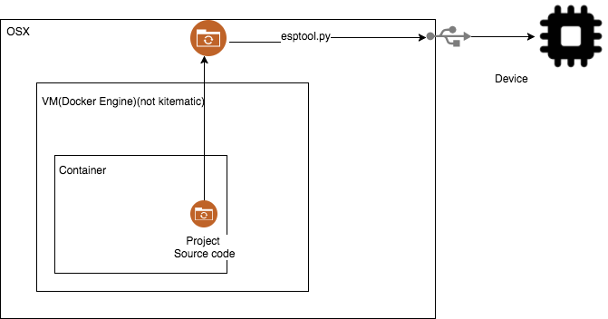

Develop with ESP8266 on OSX with docker

 Figure source(https://www.draw.io/#G0B2TRUL2zcARFSWRlZFJISS1JWU0)

### Prerequisite

1. Docker
2. Netbean
3. Python 2.7
4. Driver for CHG340(https://github.com/adrianmihalko/ch340g-ch34g-ch34x-mac-os-x-driver)